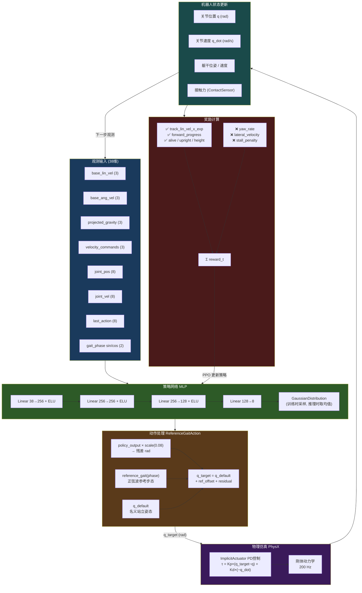

# Guguji IsaacLab 强化学习完全指南

> 面向 RL 小白的双足机器人训练全流程详解

---

## 目录

1. [双足机器人设计核心要点](#1-双足机器人设计核心要点)
2. [物理 AI 入门](#2-物理-ai-入门)
3. [强化学习（RL）精讲](#3-强化学习rl精讲)
4. [Isaac Lab 关键配置详解](#4-isaac-lab-关键配置详解)
5. [全流程实操](#5-全流程实操)
6. [训练结果分析与优化](#6-训练结果分析与优化)

---

## 1. 双足机器人设计核心要点

### 1.1 Guguji 的机械结构

Guguji 是一个小型双足机器人，总质量约 3.4 kg，拥有 8 个旋转关节：

```
左腿：left_hip_pitch → left_knee_pitch → left_ankle_pitch → left_ankle（侧摆）
右腿：right_hip_pitch → right_knee_pitch → right_ankle_pitch → right_ankle（侧摆）
```

**为什么只有 pitch 方向的髋关节？**

真实双足机器人通常有 3 自由度髋关节（roll/pitch/yaw），但 Guguji 简化为 1 自由度（pitch），这样：
- 关节数量少 → 控制更简单 → RL 更容易收敛
- 踝关节的侧摆（ankle_joint）承担了部分侧向稳定功能

### 1.2 仿生结构 vs 工程实用性的权衡

| 设计选择 | 仿生方向 | 工程/RL 方向 | Guguji 的选择 |
|---------|---------|------------|-------------|
| 髋关节自由度 | 3 DoF | 1 DoF | 1 DoF（pitch） |
| 膝关节方向 | 前向弯曲 | 前向弯曲 | 前向弯曲 |
| 踝关节 | 复杂弹性 | 刚性 + 位置控制 | 刚性 ImplicitActuator |
| 质量分布 | 腿部轻量 | 集中在躯干 | 躯干集中 |

**RL 训练友好性设计原则：**
- 关节数量越少，动作空间越小，策略越容易学
- 对称结构（左右镜像）让策略更容易泛化
- 合理的初始姿态（nominal pose）让机器人从稳定状态开始探索

### 1.3 执行器参数（`guguji.py`）

```python
# 髋/膝：刚度大，力矩大
stiffness=80.0, damping=4.0, effort_limit=10.0 Nm

# 踝 pitch：中等刚度
stiffness=40.0, damping=2.0, effort_limit=8.0 Nm

# 踝 roll：最软
stiffness=30.0, damping=1.5, effort_limit=8.0 Nm
```

**刚度（stiffness/Kp）和阻尼（damping/Kd）的直觉理解：**
- Kp 高 → 关节"弹簧"更硬，能快速回到目标位置，但容易震荡
- Kd 高 → 阻尼更强，运动更平滑，但响应变慢
- 髋/膝需要大力矩支撑体重，所以 Kp 最大；踝关节主要做微调，所以 Kp 较小

---

## 2. 物理 AI 入门

### 2.1 什么是物理 AI？

物理 AI 是指让 AI 在**物理世界（或物理仿真）中学习和执行任务**的技术方向。与纯语言/图像 AI 不同，物理 AI 需要：

1. **感知物理状态**：关节角度、速度、接触力、重力方向
2. **输出物理动作**：关节力矩或目标位置
3. **在物理约束下优化**：不能穿墙、不能违反牛顿定律

### 2.2 为什么仿真很重要？

真实机器人训练的问题：
- 硬件磨损：RL 需要数百万次交互，真实关节会坏
- 速度慢：真实时间 1 秒 = 仿真 1 秒，但 GPU 仿真可以 100x 加速
- 安全风险：机器人摔倒会损坏硬件

Isaac Sim + Isaac Lab 的解决方案：
- **GPU 并行仿真**：同时跑 4096 个环境，相当于 4096 个机器人同时训练
- **物理精度**：PhysX 引擎提供接近真实的刚体动力学
- **Sim-to-Real**：在仿真中训练好的策略可以迁移到真实机器人

### 2.3 物理 AI 改变了什么？

传统机器人控制：
```
人工设计步态 → 手写控制器 → 调参 → 部署
（需要专家知识，泛化性差）
```

物理 AI（RL）方式：
```
定义奖励函数 → 机器人自己探索 → 自动发现策略 → 部署
（需要好的奖励设计，泛化性强）
```

---

## 3. 强化学习（RL）精讲

### 3.1 核心概念

强化学习的核心循环：

```
环境状态 s_t
    ↓
策略网络 π(a|s)  ← 这就是我们要训练的神经网络
    ↓
动作 a_t（关节目标位置）
    ↓
仿真执行
    ↓
新状态 s_{t+1} + 奖励 r_t
    ↓
（循环）
```

**关键术语对照表：**

| 术语 | 机器人中的含义 |
|-----|-------------|
| 状态 (State) | 关节角度、速度、重力方向、速度指令等 38 维向量 |
| 动作 (Action) | 8 个关节的目标位置偏移量 |
| 奖励 (Reward) | 前进速度跟踪 + 姿态保持 - 不良行为惩罚 |
| 策略 (Policy) | MLP 神经网络，输入状态输出动作 |
| 回合 (Episode) | 一次从站立到摔倒/超时的完整过程（20 秒） |

### 3.2 PPO 算法直觉理解

Guguji 使用 **PPO（Proximal Policy Optimization）**，这是目前机器人 RL 最常用的算法。

**核心思想：**
> 每次更新策略时，不要走太大的步子，保证新策略和旧策略差距不太大（"proximal"的含义）

```
旧策略 π_old 收集数据
    ↓
计算优势函数 A（这个动作比平均好多少？）
    ↓
更新策略 π_new，但限制 π_new/π_old 的比值在 [1-ε, 1+ε] 内
（ε = clip_param = 0.15）
```

**为什么需要 clip？**
如果不限制，一次更新可能把策略改得太多，导致训练崩溃。

### 3.3 奖励函数设计：最关键的部分

奖励函数决定了机器人学到什么行为。Guguji 的奖励分三类：

**任务奖励（让机器人往前走）：**
```python
track_lin_vel_x_exp  # 速度跟踪，weight=4.8（最重要）
forward_progress     # 实际前进距离，weight=6.0
alive_bonus          # 活着就有奖励，weight=0.6
```

**姿态奖励（让机器人站得好）：**
```python
upright              # 保持直立，weight=1.6
height               # 保持目标高度 0.32m，weight=0.9
hip_alternation      # 左右髋关节交替运动，weight=0.5
knee_flexion         # 膝关节适度弯曲，weight=0.35
feet_air_time        # 单脚支撑时间，weight=0.5
```

**惩罚项（避免不良行为）：**
```python
lateral_velocity     # 侧向速度，weight=-0.3
yaw_rate             # 偏航角速度（防止绕圈），weight=-0.5  ← 关键！
backward_velocity    # 后退，weight=-2.8
stall_penalty        # 原地不动，weight=-4.6
action_rate          # 动作变化太快，weight=-0.004
```

**奖励设计的常见坑：**

| 问题现象 | 根本原因 | 解决方法 |
|---------|---------|---------|
| 机器人绕圈走 | 没有偏航角速度惩罚 | 加 `yaw_rate` 惩罚 |
| 机器人原地跳 | `alive_bonus` 太高 | 降低 alive_bonus 权重 |
| 机器人趴着不动 | `stall_penalty` 不够强 | 增大 stall_penalty 权重 |
| 步态不对称 | 缺少对称性约束 | 加左右关节对称惩罚 |

### 3.4 课程学习（Curriculum Learning）

直接让机器人学 0.3 m/s 的速度太难，用课程学习逐步提升难度：

```
阶段 1：0.10 m/s → 先学会直行
阶段 2：0.15 m/s → 速度提升
阶段 3：0.20 m/s → 继续提升
...
最终：0.30 m/s
```

触发条件：当 80% 的环境都能成功跟踪当前速度时，提升目标速度 0.02 m/s。

---

## 4. Isaac Lab 关键配置详解

### 4.1 整体架构

```
Isaac Lab 任务 = 场景(Scene) + MDP配置
                              ├── 观测(Observations)
                              ├── 动作(Actions)
                              ├── 奖励(Rewards)
                              ├── 终止条件(Terminations)
                              ├── 事件(Events / 域随机化)
                              └── 课程(Curriculum)
```

### 4.2 观测空间（38 维）

```python
base_lin_vel      # 3维：躯干线速度（body frame）
base_ang_vel      # 3维：躯干角速度（body frame）
projected_gravity # 3维：重力在body frame的投影（判断倾斜）
velocity_commands # 3维：速度指令 [vx, vy, ω_z]
joint_pos         # 8维：关节位置（相对nominal pose的偏差）
joint_vel         # 8维：关节速度
actions           # 8维：上一步的动作
gait_phase        # 2维：参考步态的相位 [sin(φ), cos(φ)]
```

**为什么用 body frame 而不是 world frame？**
body frame 的速度和角速度对机器人的朝向不敏感，策略可以泛化到任意朝向。

### 4.3 动作空间（8 维）—— 完整链路说明

**策略网络输出的是什么？**

策略网络输出 8 个无量纲的残差数值（通常在 [-1, 1] 附近），**不是力矩，不是速度，是关节位置目标的修正量**。完整的动作链路如下：

```
策略网络输出 (8维, 无量纲)
    ↓ × scale=0.08
残差 (rad，最大 ±0.08 rad ≈ ±4.6°)
    ↓ +
参考步态偏移 reference_gait(phase)  ← 正弦波，提供基础步态
    ↓ +
名义关节位置 q_default              ← 站立姿态
    ↓ =
关节位置目标 q_target (rad)
    ↓
ImplicitActuator（PD 控制器，在仿真内部）
    τ = Kp × (q_target - q) + Kd × (0 - q_dot)
    ↓
关节力矩 τ (Nm)                     ← 真正作用在物理引擎上的量
    ↓
PhysX 物理仿真
```

**三种控制模式的对比：**

| 控制模式 | 策略输出 | 优点 | 缺点 |
|---------|---------|-----|-----|
| 位置控制（Guguji 用的） | 关节目标位置 (rad) | 训练稳定，容易收敛 | 需要调好 Kp/Kd |
| 力矩控制 | 直接力矩 (Nm) | 最接近真实，控制精细 | 训练难，容易爆炸 |
| 速度控制 | 关节目标速度 (rad/s) | 介于两者之间 | 较少用于双足 |

**为什么用"参考步态 + 残差"而不是纯位置控制？**

纯位置控制让策略从零开始学所有关节运动，探索空间太大。参考步态提供了一个合理的初始步态模板（正弦波），策略只需要学习微小的修正量，大幅降低了学习难度：

```python
# actions.py 核心代码
q_target = q_default + reference_gait_offset(phase) + policy_output * 0.08
asset.set_joint_position_target(q_target)  # 发给 PD 控制器
```

**PD 控制器参数的影响：**

```
Kp=80, Kd=4（髋/膝）
τ = 80 × (q_target - q_current) + 4 × (0 - q_dot)
```

- Kp 越大 → 关节越"硬"，能更快跟上目标位置，但容易震荡
- Kd 越大 → 阻尼越强，运动越平滑，但响应变慢
- 力矩上限 10 Nm 防止执行器输出过大力矩损坏关节

**完整数据流向图：**



### 4.4 终止条件

```python
time_out         # 超过 20 秒 → 正常结束
base_contact     # 躯干触地 → 摔倒，立即终止
bad_orientation  # 倾斜超过 0.9 rad（约 52°）→ 终止
base_height      # 高度低于 0.21 m → 终止
```

### 4.5 域随机化（Events）

让策略在真实环境中也能工作的关键技术：

```python
physics_material  # 随机化摩擦系数（0.7~1.0）
add_base_mass     # 随机增减躯干质量（±0.5 kg）
push_robot        # 每 10~15 秒随机推一下机器人
```

**为什么需要域随机化？**
仿真和真实世界之间存在差距（sim-to-real gap）。通过在仿真中随机化物理参数，策略被迫学习更鲁棒的行为，从而在真实环境中也能工作。

### 4.6 PPO 超参数说明

```python
num_steps_per_env = 24    # 每次更新前收集多少步数据（每个环境）
max_iterations = 500      # 总训练轮数
learning_rate = 6e-5      # 学习率（adaptive schedule 会自动调整）
clip_param = 0.15         # PPO clip 范围（越小越保守）
entropy_coef = 0.005      # 熵正则化（鼓励探索，防止过早收敛）
desired_kl = 0.01         # 目标 KL 散度（控制每步更新幅度）
```

---

## 5. 全流程实操

### 5.1 环境准备

```bash
# 进入 IsaacLab 目录
cd ~/rlgpu_ws/IsaacLab

# 安装 guguji_locomotion 包（只需一次）
./isaaclab.sh -p -m pip install -e ~/Desktop/guguji_simulation/guguji_isaaclab/source/guguji_locomotion
```

### 5.2 开始训练

```bash
# 平地训练（推荐从这里开始）
./isaaclab.sh -p ~/Desktop/guguji_simulation/guguji_isaaclab/scripts/rsl_rl/train.py \
    --task=Isaac-Velocity-Flat-Guguji-v0 \
    --num_envs=4096

# 崎岖地形训练（需要先在平地训练好）
./isaaclab.sh -p ~/Desktop/guguji_simulation/guguji_isaaclab/scripts/rsl_rl/train.py \
    --task=Isaac-Velocity-Rough-Guguji-v0 \
    --num_envs=2048
```

**训练时间参考（RTX 3090）：**
- 500 iterations × 4096 envs × 24 steps = ~49M 步
- 预计训练时间：约 2~4 小时

### 5.3 查看训练进度

训练日志保存在：
```bash
~/rlgpu_ws/IsaacLab/logs/rsl_rl/guguji_flat/YYYY-MM-DD_HH-MM-SS/
```

用 TensorBoard 查看：

```bash
cd ~/rlgpu_ws/IsaacLab
./isaaclab.sh -p -m tensorboard --logdir logs/rsl_rl/guguji_flat
# 浏览器打开 http://localhost:6006
```

### 5.4 可视化推理

```bash
./isaaclab.sh -p ~/Desktop/guguji_simulation/guguji_isaaclab/scripts/rsl_rl/play.py \
    --task=Isaac-Velocity-Flat-Guguji-v0 \
    --num_envs=50
```

脚本会自动加载最新的 checkpoint，并在 Isaac Sim 中可视化 50 个机器人同时运行。

### 5.5 文件结构速查

```
guguji_isaaclab/
├── scripts/rsl_rl/
│   ├── train.py          # 训练入口
│   └── play.py           # 推理/可视化入口
└── source/guguji_locomotion/guguji_locomotion/
    ├── assets/
    │   └── guguji.py     # 机器人 URDF 配置、执行器参数
    └── tasks/locomotion/velocity/
        ├── velocity_env_cfg.py          # 基础环境配置（奖励、观测、终止等）
        ├── config/guguji/
        │   ├── flat_env_cfg.py          # 平地任务配置
        │   ├── rough_env_cfg.py         # 崎岖地形任务配置
        │   └── agents/rsl_rl_ppo_cfg.py # PPO 超参数
        └── mdp/
            ├── rewards.py               # 自定义奖励函数
            ├── observations.py          # 自定义观测函数
            ├── actions.py               # 参考步态动作
            └── curriculums.py           # 速度课程
```

---

## 6. 训练结果分析与优化

### 6.1 TensorBoard 关键指标

| 指标 | 含义 | 健康范围 |
|-----|-----|---------|
| `Train/mean_reward` | 平均回合奖励 | 持续上升 |
| `Train/mean_episode_length` | 平均回合长度 | 接近 1000 步（20秒） |
| `Loss/value_function` | Critic 损失 | 先升后降 |
| `Loss/surrogate` | Actor 损失 | 在 0 附近波动 |
| `Policy/mean_noise_std` | 策略探索噪声 | 训练后期应下降 |
| `Curriculum/velocity_command` | 当前课程速度 | 应逐步上升 |

### 6.2 常见问题排查

**问题：机器人一直摔倒，回合很短**
- 检查 `base_height` 终止阈值是否太高
- 检查初始姿态 `init_state` 是否合理
- 降低 `push_robot` 的力度

**问题：机器人绕圈走**
- 确认 `yaw_rate` 惩罚项存在且权重足够（建议 -0.3 ~ -0.5）
- 检查 `lateral_velocity` 惩罚是否生效

**问题：步态不对称（一侧腿抬得更高）**
- 增加 `hip_alternation` 奖励权重
- 添加左右关节对称性惩罚

**问题：训练崩溃（std 变负）**
- 使用 `noise_std_type="log"` 参数化，保证 std 恒正
- 降低学习率

**问题：策略不收敛，奖励不上升**
- 检查奖励函数量级是否合理（各项奖励不要差太多数量级）
- 增大 `entropy_coef` 增加探索
- 检查观测是否包含足够信息

### 6.3 优化方向

**提升直行稳定性：**
1. 增大 `yaw_rate` 惩罚权重（-0.5 → -1.0）
2. 增大 `lateral_velocity` 惩罚权重（-0.3 → -0.5）
3. 添加左右关节对称性奖励

**提升速度：**
1. 调整课程上限（`max_vel`）
2. 增大 `track_lin_vel_x_exp` 权重
3. 调整参考步态参数（步频、步幅）

**提升鲁棒性（为 sim-to-real 准备）：**
1. 增大域随机化范围（摩擦系数、质量）
2. 增大 `push_robot` 力度
3. 在观测中加入延迟模拟

### 6.4 Checkpoint 管理

```bash
# 查看所有保存的 checkpoint
ls ~/rlgpu_ws/IsaacLab/logs/rsl_rl/guguji_flat/

# 从指定 checkpoint 继续训练
./isaaclab.sh -p scripts/rsl_rl/train.py \
    --task=Isaac-Velocity-Flat-Guguji-v0 \
    --resume True \
    --load_run 2026-04-18_15-33-29 \
    --load_checkpoint model_19999.pt
```

---

## 附录：关键参数速查

### 奖励权重（`velocity_env_cfg.py`）

| 奖励项 | 权重 | 作用 |
|-------|-----|-----|
| `track_lin_vel_x_exp` | +4.8 | 速度跟踪（核心） |
| `forward_progress` | +6.0 | 前进距离 |
| `alive_bonus` | +0.6 | 存活奖励 |
| `upright` | +1.6 | 直立姿态 |
| `height` | +0.9 | 目标高度 |
| `yaw_rate` | -0.5 | 防止绕圈 |
| `lateral_velocity` | -0.3 | 防止侧移 |
| `backward_velocity` | -2.8 | 防止后退 |
| `stall_penalty` | -4.6 | 防止原地不动 |

### 执行器参数（`guguji.py`）

| 关节组 | Kp | Kd | 力矩限制 |
|-------|----|----|---------|
| 髋/膝 | 80 | 4.0 | 10 Nm |
| 踝 pitch | 40 | 2.0 | 8 Nm |
| 踝 roll | 30 | 1.5 | 8 Nm |

---

## 7. Sim-to-Real 深度解析：8 维残差如何驱动真实电机

> 以灵足时代 RS00 电机为例，完整拆解从策略网络输出到电机转矩的每一步

### 7.1 RS00 电机关键参数解读

| 参数 | 数值 | 含义 |
|-----|-----|-----|
| 空载转速 | 315 rpm = **33 rad/s** | 电机最高转速（无负载） |
| 额定负载 | **5 N·m** | 可长期持续输出的力矩 |
| 峰值负载 | **14 N·m** | 短时最大力矩（不可持续） |
| 额定转速 | 100 rpm = **10.5 rad/s** | 额定负载下的转速 |
| 转矩常数 Kt | **1.48 N·m/Arms** | 每安培电流产生多少力矩 |
| 反电势 Ke | 9.5 Vrms/kRPM = **0.091 V/(rad/s)** | 转速产生的反向电压 |
| 最大相电流 | 15.5 Apk | 硬件电流保护上限 |
| 供电电压 | 48 V | 系统总线电压 |

**与仿真参数的对比：**

```
仿真 effort_limit = 10 Nm
  → RS00 额定 5 Nm（长期），峰值 14 Nm（短时）
  → 10 Nm 对应电流：10 / 1.48 = 6.76 Arms → 峰值 9.56 Apk（安全）

仿真 velocity_limit = 2.0 rad/s
  → RS00 额定转速 10.5 rad/s，空载 33 rad/s
  → 2.0 rad/s 非常保守，电机有充足速度余量
```

仿真中设置的 2.0 rad/s 速度限制是**刻意保守的**，目的是让步态慢而稳定，避免关节运动过快导致仿真不稳定。

### 7.2 完整控制链路：从策略输出到电机转矩

```
┌─────────────────────────────────────────────────────────────────┐
│  策略网络（50 Hz，GPU）                                           │
│  输入：38维观测向量                                               │
│  输出：8个无量纲残差 ∈ [-1, 1]（近似）                            │
└──────────────────────────┬──────────────────────────────────────┘
                           │ × scale = 0.08
                           ▼
┌─────────────────────────────────────────────────────────────────┐
│  ReferenceGaitAction（50 Hz，CPU）                               │
│  q_target = q_default + ref_gait(φ) + residual × 0.08          │
│  单关节最大残差：±0.08 rad ≈ ±4.6°                               │
└──────────────────────────┬──────────────────────────────────────┘
                           │ q_target (rad) via CAN/RS485
                           ▼
┌─────────────────────────────────────────────────────────────────┐
│  电机控制器（1000 Hz，MCU）                                       │
│  MIT mini-cheetah 风格位置控制报文：                              │
│  [q_target, q_dot_target=0, Kp, Kd, tau_ff=0]                  │
│                                                                  │
│  τ_cmd = Kp × (q_target − q_actual)                            │
│        + Kd × (0 − q_dot_actual)                               │
│  Kp = 80 N·m/rad，Kd = 4 N·m·s/rad（与仿真一致）               │
└──────────────────────────┬──────────────────────────────────────┘
                           │ τ_cmd (Nm)，限幅到 ±10 Nm
                           ▼
┌─────────────────────────────────────────────────────────────────┐
│  FOC（磁场定向控制，10~20 kHz，MCU）                              │
│  τ_cmd → I_q_target = τ_cmd / Kt = τ_cmd / 1.48               │
│  例：τ = 5 Nm → I_q = 3.38 Arms → I_peak = 4.78 Apk           │
│  电流环 PI 控制 → PWM 占空比 → 三相逆变器                         │
└──────────────────────────┬──────────────────────────────────────┘
                           │ 三相电流（最大 15.5 Apk）
                           ▼
┌─────────────────────────────────────────────────────────────────┐
│  RS00 电机（物理世界）                                            │
│  电磁力矩 τ = Kt × I_q = 1.48 × I_q                            │
│  关节运动 → 机器人行走                                            │
└─────────────────────────────────────────────────────────────────┘
```

### 7.3 频率层级与延迟

真实系统有多个控制频率层级，这是 sim-to-real 最容易踩坑的地方：

| 层级 | 频率 | 执行内容 |
|-----|-----|---------|
| 策略推理 | **50 Hz** | 神经网络前向传播，输出 q_target |
| CAN 通信 | **50~500 Hz** | 发送位置指令到电机控制器 |
| 电机位置环 | **1000 Hz** | PD 控制，计算 τ_cmd |
| FOC 电流环 | **10~20 kHz** | 电流控制，输出 PWM |

**延迟的影响：**

```
仿真：策略输出 → 立即生效（0 延迟）
真实：策略输出 → CAN 发送（~1ms）→ 电机接收 → 下一个控制周期生效（~1ms）
总延迟：约 2~5 ms
```

2~5 ms 的延迟在 50 Hz（20 ms 周期）下占 10~25%，**会导致策略在真实机器人上表现变差**。

**解决方法：在仿真中加入延迟随机化：**

```python
# 在 EventCfg 中添加观测延迟
observation_delay = EventTerm(
    func=mdp.randomize_observation_delay,
    mode="startup",
    params={"delay_range": (0.0, 0.005)},  # 0~5ms
)
```

### 7.4 PD 增益的 Sim-to-Real 匹配

仿真中的 `ImplicitActuator` 等价于在每个物理步（5ms）内执行：

```
τ = Kp × (q_target − q) + Kd × (−q_dot)
  = 80 × (q_target − q) + 4 × (−q_dot)
```

真实 RS00 电机控制器使用相同的公式，只需在上位机发送指令时携带 Kp=80, Kd=4 即可。

**增益合理性验证：**

```
最大位置误差场景：q_target - q = 0.08 rad（一个完整残差）
τ = 80 × 0.08 = 6.4 Nm  < 10 Nm 限制 ✓

最大速度场景：q_dot = 2.0 rad/s
τ_damp = 4 × 2.0 = 8.0 Nm  < 10 Nm 限制 ✓

两者叠加最坏情况：6.4 + 8.0 = 14.4 Nm ≈ RS00 峰值 14 Nm
→ 极端情况下会触发峰值力矩，短时可接受
```

### 7.5 T-N 曲线与工作点分析

RS00 在 48V 供电下的 T-N 曲线（力矩-转速关系）：

```
力矩 (Nm)
14 |●  ← 峰值工作点（短时）
   |  \
10 |   \  ← 仿真 effort_limit
   |    \
 5 |     ●  ← 额定工作点（长期）
   |      \
 0 |_______●___→ 转速 (rad/s)
   0      10.5  33
          ↑     ↑
        额定   空载
```

**Guguji 的实际工作点：**

正常行走时，髋/膝关节力矩约 2~6 Nm，转速约 0.5~1.5 rad/s，工作在 T-N 曲线的左上角（低速大力矩区），这是 RS00 效率最高的区域。

### 7.6 部署代码框架（伪代码）

```python
# 真实机器人部署示例（50 Hz 控制循环）
import can
import numpy as np

policy = torch.jit.load("exported/policy.pt")  # 导出的 JIT 模型
can_bus = can.Bus(channel='can0', bustype='socketcan')

Kp = 80.0  # 与仿真一致
Kd = 4.0

while True:
    # 1. 读取传感器（IMU + 关节编码器）
    obs = get_observation()  # shape: (38,)

    # 2. 策略推理（~0.5ms on CPU）
    with torch.no_grad():
        action = policy(torch.tensor(obs))  # shape: (8,)

    # 3. 计算关节目标位置
    phase = get_gait_phase()
    ref_offset = compute_reference_gait(phase)
    q_target = q_default + ref_offset + action.numpy() * 0.08

    # 4. 发送 CAN 指令（MIT mini-cheetah 协议）
    for i, motor_id in enumerate(MOTOR_IDS):
        send_position_command(
            can_bus, motor_id,
            q_target=q_target[i],
            q_dot_target=0.0,
            kp=Kp, kd=Kd,
            tau_ff=0.0
        )

    # 5. 等待下一个控制周期（20ms）
    time.sleep(0.02)
```

### 7.7 Sim-to-Real 常见失败模式

| 失败现象 | 原因 | 解决方法 |
|---------|-----|---------|
| 真实机器人抖动 | Kp 太大，真实摩擦比仿真小 | 降低 Kp，或在仿真中降低摩擦系数 |
| 真实机器人步态比仿真慢 | 电机响应延迟，仿真没有建模 | 仿真中加入 action delay |
| 真实机器人向一侧偏 | 左右电机安装误差 | 在仿真中加入关节偏置随机化 |
| 真实机器人摔倒但仿真不摔 | 仿真地面摩擦太高 | 降低仿真摩擦系数，加大随机化范围 |
| 电机过热 | 力矩持续过大 | 降低 Kp，检查步态是否有不必要的大力矩 |

### 7.8 电流与热功率估算

长时间行走时需要关注电机热功率，避免过热：

```
额定工作：τ = 5 Nm → I = 3.38 Arms
铜损（主要热源）：P = I² × R_phase
RS00 相电阻约 0.5~1 Ω（估算）
P ≈ 3.38² × 0.75 ≈ 8.6 W（单电机）
8 个电机总铜损 ≈ 69 W

行走机械功率：P_mech = τ × ω ≈ 5 × 1.0 × 8 ≈ 40 W
总功耗 ≈ 110 W（48V 系统，约 2.3 A 总电流）
```

这意味着 Guguji 在正常行走时总功耗约 100~150 W，对应 48V 系统约 2~3 A，一块 5000 mAh 的 48V 电池可以支撑约 1.5~2.5 小时。
